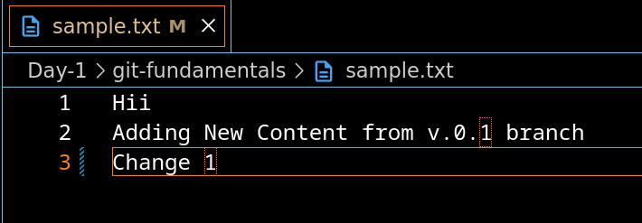
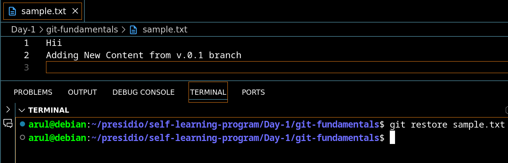
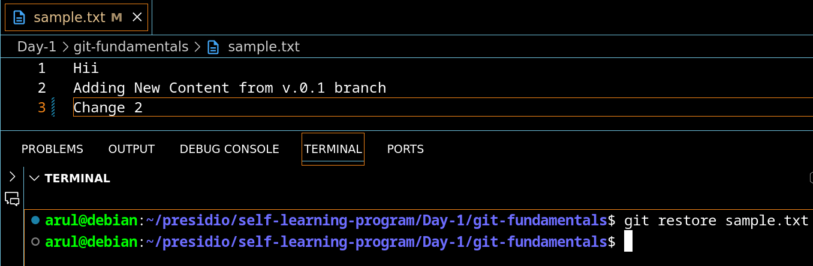
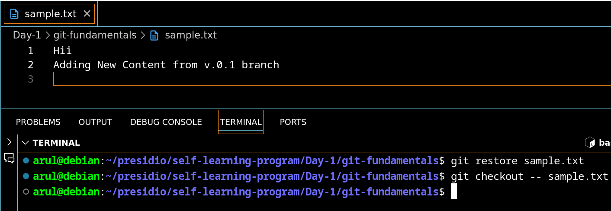
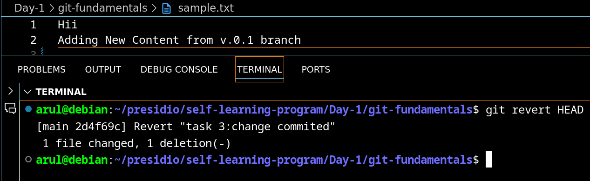
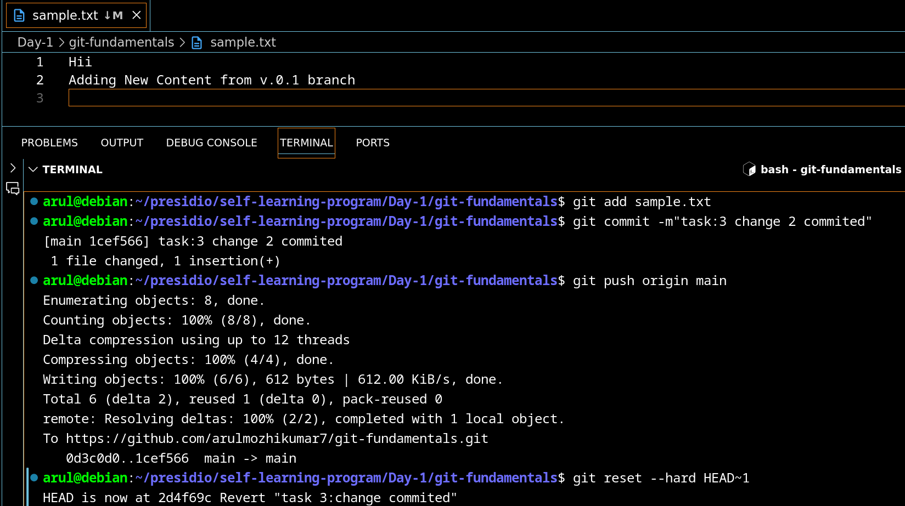

MAKING CHANGES AND UNDOING WITH RESTORE 
BEFORE RESTORE COMMAND

AFTER RESTORE COMMAND

MAKING CHANGES AND UNDOING WITH CHECKOUT --
BEFORE CHECKOUT COMMAND

AFTER CHECKOUT COMMAND

UNDOING COMMIT WITH REVERT

UNDOING COMMIT WITH RESET
